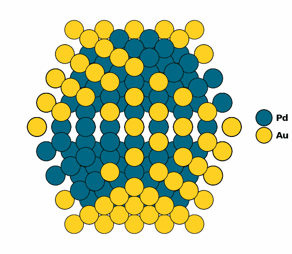

Usage
=====

.. _installation:

Installation
------------

To use *cp2k_helper*, first install it using pip:

.. code-block:: console

   (venv) $ pip install cp2k_helper

You should also be able to instal *ce_expansion* using the following code:

.. code-block:: console

   (venv) $ pip install git+https://github.com/mpourmpakis/ce_expansion.git

Finally, you can install my package from Demystifying the Chemical Ordering of Polymetallic Nanoparticles.
It's a wrapper around ce_expansion with some extra functionality.

.. code-block:: console

   (venv) $ git clone https://github.com/mpourmpakis/CANELa_NP.git
   (venv) $ cd CANELA_NP
   (venv) $ pip install -e .

Other dependencies include:

* ASE
* Click
* Pandas
* Numpy 
* Matplotlib
* Lxml (for web scraping)

Package Overviews
----------------

cp2k_helper
^^^^^^^^^^^^^

.. code-block:: python
   import numpy as np 
   import pandas as pd
   np.random.seed(0)

To retrieve a list of random ingredients,
you can use the ``lumache.get_random_ingredients()`` function:

.. autofunction:: lumache.get_random_ingredients

The ``kind`` parameter should be either ``"meat"``, ``"fish"``,
or ``"veggies"``. Otherwise, :py:func:`lumache.get_random_ingredients`
will raise an exception.

.. autoexception:: lumache.InvalidKindError

CANELa_NP
^^^^^^^^^^^^^

Importing packages:

.. code-block:: python

   from CANELa_NP.Nanotools import Nanoparticle
   import ase.cluster as ac

Creating a bimetallic ase atoms object:

.. code-block:: python

   atoms = ac.Icosahedron('Au', 5)
   atoms.symbols[100:] = 'Pd'

Creating a nanoparticle object:

.. code-block:: python

   NP = Nanoparticle(atoms)

Visualizing the non-optimized chemical ordering:

.. code-block:: python

   NP.core_shell_plot()

.. image:: ../../README_Notebook_10_0.png

Optimizing the chemical ordering with a genetic algorithm:

.. code-block:: python

   NP.run_ga(max_gens=-1,max_nochange=1_000)

.. code-block:: console

   --------------------------------------------------
   GA Sim for Au100Pd209 - none:
   Min: -3.66177 eV/atom -- Gen: 02840
   Form: Au100Pd209
   nAtom: 309
   nGens: 2840
   Start: -3.44202 eV/atom
   Best: -3.66177 eV/atom
   Diff: -0.21974 eV/atom (6.38%)
   Mute: 80.0%
   Pop: 50
   Time: 0:00:28
   --------------------------------------------------
   Saving optimized structure...
   Done!

Visualizing the optimized chemical ordering:

.. code-block:: python
   
   NP.core_shell_plot()

.. image:: ../../README_Notebook_14_0.png

Visualizing the NP (with ase gui and molgif)

.. image:: ../../full_np.png 
   :width: 40%

For example:

>>> import lumache
>>> lumache.get_random_ingredients()
['shells', 'gorgonzola', 'parsley']

.. toctree::
   :caption: Contents:
   :glob:
   usage/*
